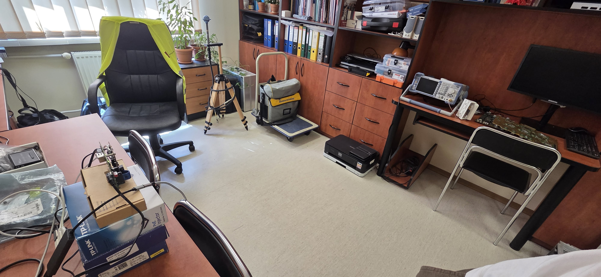
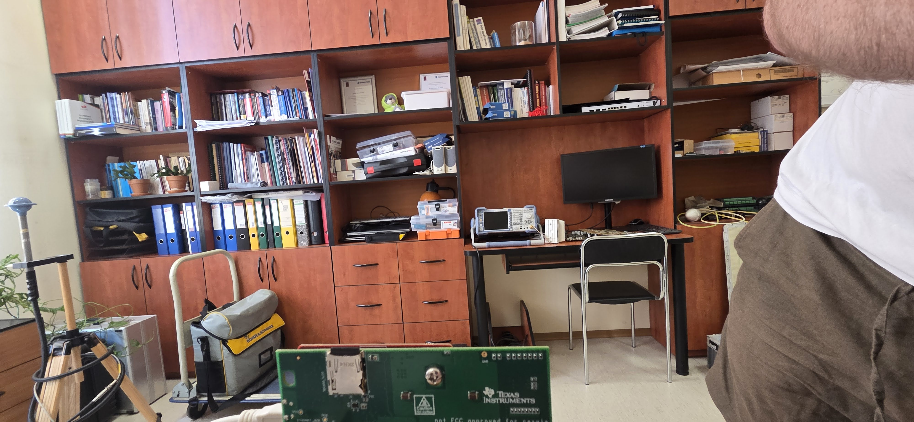
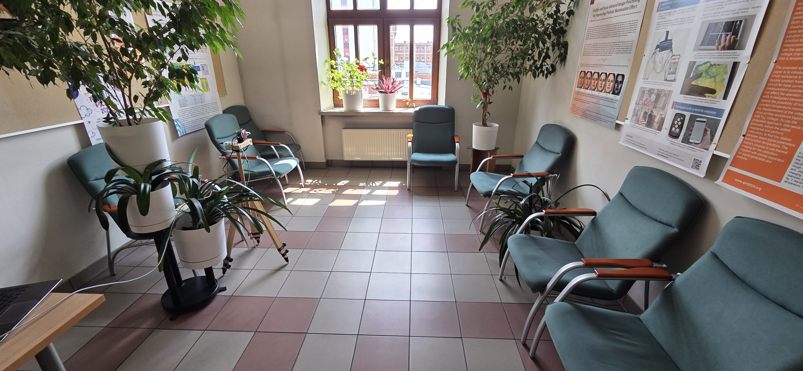
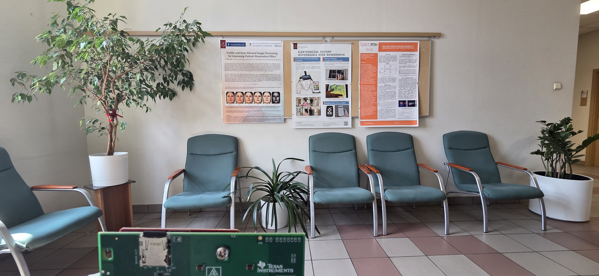

# Matlab setup

[Matlab TI radar setup](https://nl.mathworks.com/help/radar/ug/install-support-for-ti-mmwave-hardware.html#mw_8ed6eefa-adc8-4d4f-863b-763aa02a6847)

> `Simulink` must be installed with your Matlab instance

# HW setup

[DCA1000 User Guide - Setup Section](https://www.ti.com/lit/ug/spruij4a/spruij4a.pdf#page=16)
[Firewall setup](https://nl.mathworks.com/help/radar/ug/issues-with-firewall-settings.html)

> Used Ethernet interface must support 1 Gbit link speed

1. Follow the setup guide of the DCA1000 via `mmWaveRadarSetup`

> If connection can't be established, configure firewall to allow connections to DCA1000

# Radar configuration

Use [Visualizer tool](https://dev.ti.com/gallery/view/mmwave/mmWave_Demo_Visualizer/ver/3.6.0/) to get a configuration file suited to your mesurement scenario.

Load the file when calling `dca1000()` in matlab.

# Mesurements

Open the [record](record.mlx) live script.

### HW CONFIGURATION

Choose the radar type and optionally load your desired configuration. Run the configuration section to configure the radar and connect to DCA1000.

### MEASUREMENT

In the second section select the quantifiers for the measurement and when ready run the section.

Data will be saved on disk with incrementing folder suffix, so you can measure in a loop.

# Data

Measurements are stored in folders. Their names consist of parts joined with an underscore:

- place
  |Code|Descripton|Setup|Radar POV|
  |-|-|-|-|
  |310|Room 310|||
  |hall-along|3rd floor hallway end|||
- radar position (relative to test subjects)
  - side - radar at ~1.2 meters
- type
  - slow walk (sw)
  - fast walk (fw)
  - run (run)
  - sneak (snk)
- person index from the [people list](#people)

### People:

0. Jakub P.
1. Kamil W.
2. Karol N.
3. Patryk Ś.
